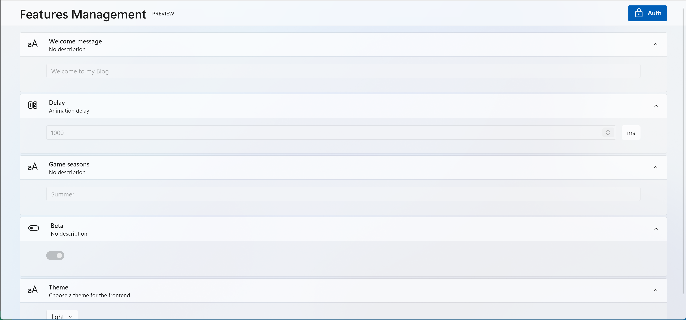

In order to get a working Feature Management system in your API, you first have to add the features that should be used by your API. Don't forget to set a storage provider too.

```cs
public void ConfigureServices(IServiceCollection services)
{
    services.AddFeatures(c =>
    {
        var themes = new List<string>
        {
            "light",
            "dark"
        };

        // Storage provider
        c.AddInMemoryStorage()
            // Beta feature, enabled by default
            .ServerFeature("Beta", true)
            // Welcome message
            .ServerFeature("WelcomeMessage", "Welcome to my Blog")
            // Theme feature, "light" by default
            .ClientFeature("Theme", themes[0], "Choose a theme for the frontend", themes);
    });

    services.AddScoped<IFeaturesAuthService, DefaultFeaturesAuthService>();

    // ...
}

public void Configure(IApplicationBuilder app, IWebHostEnvironment env)
{
    // Apply features configuration
    app.UseFeatures();

    // Enable features UI
    app.UseEndpoints(endpoints =>
    {
        endpoints.MapFeaturesUI();
    });
}
```

You will then be able to display the UI at the following url: `/features-ui`.


