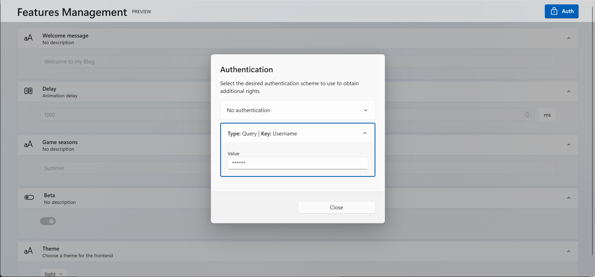

## Configuration

If you like to see the features for yourself. You can enable the UI by configuring it:

```cs
public void Configure(IApplicationBuilder app, IWebHostEnvironment env)
{
    // ...

    app.UseEndpoints(endpoints =>
    {
        endpoints.MapFeaturesUI();
    });
}
```

You will then be able to display the UI at the following url: `/features-ui`.

## Authentication

You should add an `IFeaturesAuthService` to handle features authentication.

```csharp
services.AddScoped<IFeaturesAuthService, DefaultFeaturesAuthService>();
```

There is a default service you can use named `DefaultFeaturesAuthService`. Here is the how it works:

- Everyone can read all features
- No one can update a _server_ feature
- Each user can update a _client_ feature
- No way to define a client id (returns `null`)

## Authorization

There is some authentication schemes you can use to authenticate users and give access to features:

- No authentication (anonymous)
- Query params authentication
- Header authentication

For example, you can apply a JWT Bearer authentication using the `Authorization` HTTP header and define a `IFeaturesAuthService` to use the user information stored inside the JWT token.

## UI settings

You can configure the UI by providing the authentication schemes used in the application:

```csharp
configuration.AuthSchemes.Add(new NoAuthenticationScheme());
configuration.AuthSchemes.Add(new QueryAuthenticationScheme { Key = "Username" });
```

It will give each user an access to the `Authentication` dialog to select the desired authentication mechanism.


