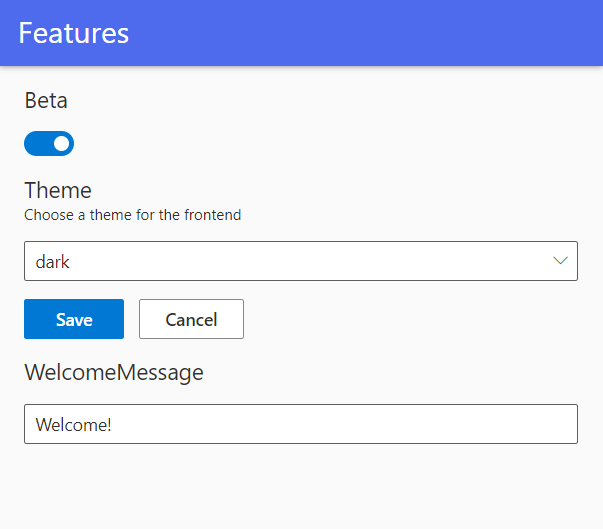

# AspNetCore.FeatureManagement.UI

[](https://www.codefactor.io/repository/github/odonno/aspnetcore.featuremanagement.ui)

| Package | Versions |
| ------- | -------- |
| AspNetCore.FeatureManagement.UI | [](https://www.nuget.org/packages/AspNetCore.FeatureManagement.UI/) |
| AspNetCore.FeatureManagement.UI.InMemory.Storage | [](https://www.nuget.org/packages/AspNetCore.FeatureManagement.UI.InMemory.Storage/) |
| AspNetCore.FeatureManagement.UI.SqlServer.Storage | [](https://www.nuget.org/packages/AspNetCore.FeatureManagement.UI.SqlServer.Storage/) |

Perfectly designed UI for Feature Flags in ASP.NET Core Web API

**ASP.NET Core** versions supported: 3.1

This package allows you to configure your application inside your own ASP.NET Core Web API. You can create and configure a large number of feature toggles.

### Purpose

This library is meant to create, use and provide something developers are calling `Feature Flag` or `Feature Toggle`. It can be viewed as a configuration system. The main benefit over using a simple configuration file like `appsettings.json` is that:

1. You can change any configuration value dynamically
2. You get a simple UI to configure your app

##### Do's and Don'ts

This library has for only purpose to let you create, use and provide Feature Flags inside your ASP.NET Core Web API. It is NOT meant to become a CMS or any storage system (file, SQL or NoSQL). Here are some examples of what you can or cannot do with the library:

* ✅ create features that can be manually deactivated at any time
* ✅ create a light/dark theme feature
* ✅ temporarily store a welcome message
* ❌ store a list of blog articles
* ❌ store chat messages
* ❌ store sensitive data (credentials, connection strings, etc...)

### Configuration

##### Feature definition

First, you have to add the features that should be used by your API. Don't forget to set a storage provider too.

```cs
public void ConfigureServices(IServiceCollection services)
{
    services.AddFeatures(c =>
    {
        var themes = new List<string>
        {
            "light",
            "dark"
        };

        // Storage provider
        c.AddInMemoryStorage()
            // Beta feature, enabled by default
            .ServerFeature("Beta", true)
            // Welcome message
            .ServerFeature("WelcomeMessage", "Welcome to my Blog")
            // Theme feature, "light" by default
            .ClientFeature("Theme", themes[0], "Choose a theme for the frontend", themes);

        c.GetClientId = () =>
        {
            // Retrieve client id used to identify the user of each client features
            return Guid.NewGuid().ToString(); // EXAMPLE
        };

        c.HandleReadAuth = (Feature feature, string? clientId) =>
        {
            // Indicates if the user can see this feature
            return true; // DEFAULT
        };
        c.HandleWriteAuth = (Feature feature, string? clientId) =>
        {
            // Indicates if the user can update this feature (server features are often only managed by an admin)
            return feature.Type == FeatureTypes.Client; // DEFAULT
        };

        c.OnServerFeatureUpdated = (IFeature feature) =>
        {
            // Do something when a server feature is updated 
        };
        c.OnClientFeatureUpdated = (IFeature feature, string clientId) =>
        {
            // Do something when a client feature is updated 
        };
    });

    // ...
}
```

Then, don't forget to use these features. Otherwise, no feature will be applied...

```cs
public void Configure(IApplicationBuilder app, IWebHostEnvironment env)
{
    app.UseFeatures();

    // ...
}
```

##### Storage Providers

AspNetCore.FeatureManagement.UI offers several storage providers.

###### InMemory

```cs
services.AddFeatures(c =>
{
    c.AddInMemoryStorage();
});
```

###### Sql Server

```cs
services.AddFeatures(c =>
{
    string connectionString = Configuration.GetConnectionString("DefaultConnection");
    c.AddSqlServerStorage(connectionString);
});
```

##### UI

If you like to see the features for yourself. You can enable the UI by configuring it:

```cs
public void Configure(IApplicationBuilder app, IWebHostEnvironment env)
{
    // ...

    app.UseEndpoints(endpoints =>
    {
        endpoints.MapFeaturesUI();
    });
}
```

You will then be able to display the UI at the following url: `/features-ui`.



### Feature consumption

Once everything is setup, you can now consume the features in two ways:

* self-consumption = inside your Web API
* API = other services through API calls

##### Self-consumption 

Inside your ASP.NET Core Web API, you can inject the `IFeaturesService`.

```cs
public interface IFeaturesService
{
    Task<List<Feature>> GetAll();
    Task<Feature> Get(string featureName);
    Task<T> GetValue<T>(string featureName, string? clientId = null);
    Task<Feature> SetValue<T>(string featureName, T value, string? clientId = null);
}
```

You can get and use all features at once, detect if a feature is valid or not and even update the value of a feature based on your needs.

##### API

Once you map the features UI, you give everyone the ability to call an API the features. As an example, it can be pretty handy if you write a React application and you want to enable/disable some features dynamically.

The API is defined like this:

```
Retrieve all features

GET - /features
```

```
Set feature value

POST - /features/{featureName}/set
Payload: { value: boolean | number | string }
```